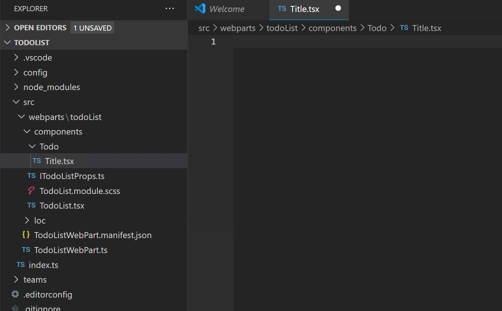
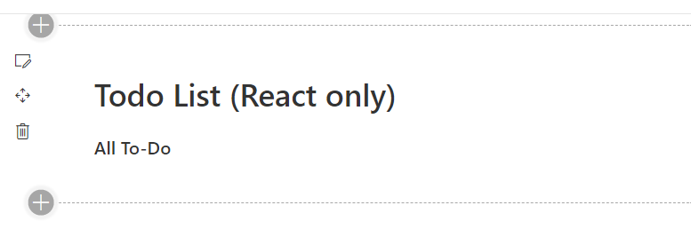

# Lab 1a – Component
Components are the basic building blocks of a React application.  TSX allows us to construct the user interface using HTML syntax mixed with Typescript code.  And components can be created either as a function or class.  Let's explore these topics in this lab.

## Exercise 1 - Creating a Simple Component
### Writing a Function Component 
Let’s create a simple project with the name **todolist**
Create a new folder in the src folder with the name **Todo**
Under todopage folder let’s create a file (component) called **Todo.tsx**
> Note: that the name of component is always capitalized.

Our project structure should look something like this. 



Let’s open Title.tsx file and build our first component.  Recall that components can be built as a class or a function.  Let's first create a functional component.  Functional components are only requiremet is that they return JSX content.  Proceed to write the Title component using the HTML below for its content as a functional component.

```html
<div className="header">
  <h1>Todo List (React only)</h1>
  <h3>All To-Do</h3>
</div>
```
Scroll down to see the solution.
<br/><br/><br/><br/><br/><br/><br/><br/><br/><br/><br/><br/><br/><br/><br/><br/><br/><br/><br/><br/><hr/>

**Solution**
```jsx
import * as React from 'react';

function Title() {
  return (
    <div className="header">
      <h1>Todo List (React only)</h1>
      <h3>All To-Do</h3>
    </div>
  );
}

export default Title;
```

### Adding Our Component to Our App
Now that the component is written, let’s import it to TodoList.tsx so that it’s part of our application.  Try to do that on your own before looking at the solution below.

Scroll down to see the solution.
<br/><br/><br/><br/><br/><br/><br/><br/><br/><br/><br/><br/><br/><br/><br/><br/><br/><br/><br/><br/><hr/>

**Solution:**
```tsx
import * as React from 'react';
import styles from './TodoList.module.scss';
import { ITodoListProps } from './ITodoListProps';
import { escape } from '@microsoft/sp-lodash-subset';
import Title from './Todo/Title'; //>>> Add
```

Notice that the first thing we need to do when working with React is to import the React library (it’s what helps us combine HTML and Javascript/Typescript into one single file). To check that’s the case what we can do is we can remove React import and see what will happen when we run our application. So, let’s give that a try in our Title.tsx file.

Remove
```jsx
import * as React from 'react';
```

let’s open the terminal and run `gulp start`

The error occurred because we must import React when using TSX syntax. 

Now that we know the purpose of importing React let’s add it back to our import statement.  Our component should look something like this:

```jsx
import * as React from 'react';

function Title() {
  return (
    <div className="header">
      <h1>Todo List (React only)</h1>
      <h3>All To-Do</h3>
    </div>
  );
}

export default Title;
```

Let’s go back to our browser now. The project should be compiled without errors (but we will add the component further below).

Let’s talk about what’s happening inside the component we just created. Our class Title component implements a function called render().  And in that function, it will use TSX (HTML & TS) so the DOM will be able to render our webpage. Finally, we export the Title component to make our it available to other components.

The next step is to include the Title component in our Webpart.  Add it to the beginning of the component. Scroll down to see the solution after you are finished.
<br/><br/><br/><br/><br/><br/><br/><br/><br/><br/><br/><br/><br/><br/><br/><br/><br/><br/><br/><br/><hr/>

**Solution**:
```jsx
import * as React from 'react';
import styles from './TodoList.module.scss';
import { ITodoListProps } from './ITodoListProps';
import { escape } from '@microsoft/sp-lodash-subset';
import Title from './Todo/Title';

export default class TodoList extends React.Component<ITodoListProps> {
  public render(): React.ReactElement<ITodoListProps> {
    return (
      <div className={ styles.todoList }>
        <Title/>
      </div>
    );
  }
}
```
Save the change.  If we go to our browser, we will see that our component is displayed there. 
 


### Writing a Class Component
Components can also be created as class components. When implementing as a class, components needs to derive from the React.Component class and implement the render method to display anything.  Proceed to rewrite the Title component using the same TSX.  Don't forgot the proper imports and to export your component as well.

Scroll down to see the solution.
<br/><br/><br/><br/><br/><br/><br/><br/><br/><br/><br/><br/><br/><br/><br/><br/><br/><br/><br/><br/><hr/>

**Solution**
```tsx
import * as React from 'react';

class Title extends React.Component {
    render() {
      return (
        <div className="header">
          <h1>Todo List (React only)</h1>
          <h3>All To-Do</h3>
        </div>
      );
    }
  }

export default Title;
```

## Exercise 2 - Add Props to Components
In this exercise, we practice passing different types of props to child components.  Props are used to send data to children components in React.  We will be using the Title component.  After the exercise, we will restore our Title component to its original content.

```jsx
import * as React from 'react';

class Title extends React.Component {
    render() {
      return (
        <div className="header">
          <h1>Todo List (React only)</h1>
          <h3>All To-Do</h3>
        </div>
      );
    }
  }

export default Title;
```

### Passing A Prop to the Title Component
We learned that a parent component can pass values to its children through the prop property which is available in a class component as the prop property.  Let's parameterize our Title component.  Modify the Title component and TodoList component so that instead of hard coding the Title's subtitle ("All To-Do"), it's received from the parent as a **subtitle** prop.

Scroll down to see the solution.
<br/><br/><br/><br/><br/><br/><br/><br/><br/><br/><br/><br/><br/><br/><br/><br/><br/><br/><br/><br/><hr/>

*TodoList.tsx*
```tsx
export default class TodoList extends React.Component<ITodoListProps, {}> {
  public render(): React.ReactElement<ITodoListProps> {
    return (
      <div className={ styles.todoList }>
        <Title subtitle="All To-Do"/>
```

*Title.tsx*
```tsx
class Title extends Component {
  render() {
    return (
      <div className="header">
        <h1>Todo List (React only)</h1>
        <h3>{this.props.subtitle}</h3>
      </div>
    );
  }
}
```

We could've also used

```tsx
        <Title subtitle={"All To-Do"} />
```
Since they both evaluation to a string.


### Accessing the Prop in the Constructor
Now, let's say you want to output the subtitle prop in the constructor.  Modify the Title component so that this can be done.

Scroll down to see the solution.
<br/><br/><br/><br/><br/><br/><br/><br/><br/><br/><br/><br/><br/><br/><br/><br/><br/><br/><br/><br/><hr/>

```tsx
class Title extends React.Component<ITitleProps> {
    constructor(prop: ITitleProps){
        super(prop);
        console.log(prop.subtitle);
    }
```

Hopefully, you were able to see that super needed to be called in order to properly initialize the prop values.

### Using Destructuring to Improve Readability
We can use destructuring to shorten some of our code so that the subtitle can simply be referenced as subtitle instead of this.props.subtitle.  Modify the Title component so that you destructure this.props.subtitle into a local subtitle variable.

Scroll down to see the solution.
<br/><br/><br/><br/><br/><br/><br/><br/><br/><br/><br/><br/><br/><br/><br/><br/><br/><br/><br/><br/><hr/>

```tsx
class Title extends React.Component<ITitleProps> {
    constructor(prop: ITitleProps){
        super(prop);
        console.log(prop.subtitle);
    }
    render() {
      const {subtitle} = this.props;
      return (
        <div className="header">
          <h1>Todo List (React only)</h1>
          <h3>{subtitle}</h3>
        </div>
      );
    }
  }
```

### Setting a Style Prop
TSX requires that the style property be set to an object collection rather than a simple string such as "font-size: 9pt; font-weight: bold" as in HTML.  Our current Title component applies the "header" class to div.  Let's add a customization for our Title by setting the font color to be blue and with a white 2px solid border as a style property.  The HTML style equivalent for that would be "color: blue; border: 2px solid white".

Scroll down to see the solution.
<br/><br/><br/><br/><br/><br/><br/><br/><br/><br/><br/><br/><br/><br/><br/><br/><br/><br/><br/><br/><hr/>

```tsx
return (
        <div className="header" style={{ color: "blue", border: "2px solid white" }}>
          <h1>Todo List (React only)</h1>
          <h3>{subtitle}</h3>
        </div>
      );
```

### Passing Children Content
Let's say we want to let the parent pass in chunks of JSX to display below the subtitle.  Modify the Title component and the TodoList component so that the TodoList can pass in an hr tag to display in the Title component as a children property.

Scroll down to see the solution.
<br/><br/><br/><br/><br/><br/><br/><br/><br/><br/><br/><br/><br/><br/><br/><br/><br/><br/><br/><br/><hr/>

*TodoList.tsx*
```tsx
public render(): React.ReactElement<ITodoListProps> {
  return (
    <div className={ styles.todoList }>
      <Title subtitle="All To-Do">
        <hr/>
      </Title>
```

*Title.tsx*
```tsx
class Title extends React.Component<ITitleProps> {
  constructor(prop: ITitleProps){
      super(prop);
      console.log(prop.subtitle);
  }
  render() {
    const {subtitle} = this.props;
    return (
      <div className="header" style={{ color: "blue", border: "2px solid white" }}>
        <h1>Todo List (React only)</h1>
        <h3>{subtitle}</h3>
        {this.props.children}
      </div>
    );
  }
}
```

Now that you've had some practice with passing properties, let's restore the TodoList and Title component back.

*Title component*
```tsx
import * as React from "react";

class Title extends React.Component {
  render() {
    return (
      <div className="header">
        <h1>Todo List (React only)</h1>
        <h3>All To-Do</h3>
      </div>
    );
  }
}
export default Title;
```
