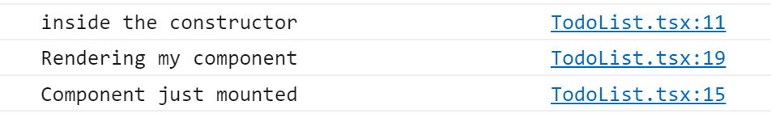

# Lab 1b - Component Lifecycle

React lifecycle is a major component when it comes to building React applications and this lab will just quickly glimpse over some of the functionalities of React lifecycles.

## Exercise 1 – Common Mounting Lifecycle methods
There are 3 common lifecycle methods related to the mounting stage.  Below is information about them and what they are used for.

**constructor(props)**
- Do call super(props) before any statement.
- **Here** is the right place to initialize state by using this.state (to be covered later)
- **Here** is the right place to bind event handlers to the class instance (another way around the this binding issue which we won't be covering)
- If you don’t initialize a state and you don’t bind methods, you don’t need to implement the constructor.
- Don’t: Avoid introducing any side-effects or subscriptions. Do not set state by using setState() in the constructor.

**componentDidMount()**
- This is invoked immediately after a component is mounted.
- **Here** is the right place for initialization that requires DOM nodes.
- **Here** is the right place if you need to load data from a remote endpoint (where to instantiate the network request).
- **Here** is the right place to set up any subscriptions (don’t forget to unsubscribe in componentWillUnmount())
- **Here** is where you interact with the browser.

**render()**
- This method is **required**.
- It examines this.props and this.state and returns one of the following: React elements, Strings and numbers, Portals, null or Booleans.
- This method should be pure and should NOT modify component state. It should return the same result each time it’s invoked and it does not directly interact with the browser.

To demonstrate the difference between these the three methods let’s go ahead and open TodoList.tsx in the **components** folder.

Since you learned about some of the common lifecycle methods, implement one of them (componentDidMount) and output a console statement.  Also add console statements to the constructor and the render method.  Scroll down when you're ready to check your answer.

<br/><br/><br/><br/><br/><br/><br/><br/><br/><br/><br/><br/><br/><br/><br/><br/><br/><br/><br/><br/><hr/>

**Solution**:
```jsx
export default class TodoList extends React.Component<ITodoListProps, {}> {
  //>>> Add Method
  constructor(props:ITodoListProps) {
    super(props);
    console.log('inside the constructor');
  }
  //>>> Add Method
  componentDidMount() {
    console.log('Component just mounted');
  }
  
  public render(): React.ReactElement<ITodoListProps> {
    console.log('Rendering my component');        //>>> Add
    return (
```

Make sure that your app is running - **gulp serve**.  Once it’s running, open the developer console and you should see something like this including the console.log output. 



From the image above we see that the constructor is what gets called even before the component mounts and then render() function, and finally we have our componentDidMount.

## Exercise 2 - Conditional Rendering and the Click Event Handler
In this exercise, we will add two buttons to our TodoList component.  One button will toggle the Title visibility state.  The other button will update the time in the Title.  We'll need to track these in a state property in the TodoList which we haven't covered yet.  So let's start with that.  Update the TodoList component to track them as shown.


*TodoList component*
```tsx
//>>> Add Interface
export interface ITodoListState {
  visible: boolean,
  time: Date
}
export default class TodoList extends React.Component<ITodoListProps, ITodoListState> {
  //>>> Add Method
  constructor(props:ITodoListProps) {
    super(props);
    console.log('inside the constructor');
    this.state = { visible: false, time: new Date() }; // Add
  }
```

Let's add two buttons to the TodoList component above the Title component.  The first button will display "Show" or "Hide" depending on the value of this.state.visible and will toggle this value when clicked on.  Use this statement to toggle the value:

```ts
this.setState({visible: !this.state.visible})
```

The other button will update the time when clicked on.  Use this statement in the click handler to update the time value.

```ts
this.setState({time: new Date()});
```

Use the this.state.visible value to conditionally display the Title component using the conditional rendering technique (`{value && <Component />}`).  And use the this.state.time value to pass to the Title component as a time property.

Finally, update the Title component to display the time value as `this.props.time.toString()` under the h3 subtitle.

This is a lot of work, so spend some time to think about how to implement it.  Scroll down when you're ready to check your answer.

<br/><br/><br/><br/><br/><br/><br/><br/><br/><br/><br/><br/><br/><br/><br/><br/><br/><br/><br/><br/><hr/>

**Solution**:
*TodoList component*
```tsx
export interface ITodoListState {
  visible: boolean,
  time: Date
}
export default class TodoList extends React.Component<ITodoListProps, ITodoListState> {
  constructor(props:ITodoListProps) {
    super(props);
    console.log('inside the constructor');
    this.state = { visible: false, time: new Date() };
  }
  componentDidMount() {
    console.log('Component just mounted');
  }
  
  public render(): React.ReactElement<ITodoListProps> {
    console.log('Rendering my component');
    return (
      <div className={ styles.todoList }>
        <button onClick={() => this.setState({ visible: !this.state.visible })}>
            {this.state.visible ? "Hide" : "Show"}
        </button>
        <button onClick={() => this.setState({ time: new Date() })}>
          Update
        </button>
        {this.state.visible && <Title time={this.state.time} />}
        <div className={ styles.container }>
        ...
```

*Title component*
```tsx
export interface ITitleProps{
  time: Date
}
class Title extends React.Component<ITitleProps> {
  render() {
    return (
      <div className="header">
        <h1>Todo List (React only)</h1>
        <h3>All To-Do</h3>
        {this.props.time.toString()}
      </div>
    );
  }
}
export default Title;
```

## Exercise 3 - The Update and Unmount Event Lifecycle
Just like we did for the TodoList component, let's add the lifecycle events and the console.log statements for them for the Title component.  Add them for:

- constructor
- componentDidMount
- componentDidUpdate
- render
- componentWillUnmount

Scroll down when you're ready to check your answer.

<br/><br/><br/><br/><br/><br/><br/><br/><br/><br/><br/><br/><br/><br/><br/><br/><br/><br/><br/><br/><hr/>

**Solution**:
```tsx
export interface ITitleProps{
  time: Date
}
class Title extends React.Component<ITitleProps> {
  constructor(props: ITitleProps) {
    super(props);
    console.log("constructor");
  }
  componentDidMount() {
    console.log("componentDidMount");
  }
  componentDidUpdate() {
    console.log("componentDidUpdate");
  }
  componentWillUnmount() {
    console.log("componentWillUnmount");
  }

  render() {
    return (
      <div className="header">
        <h1>Todo List (React only)</h1>
        <h3>All To-Do</h3>
        {this.props.time.toString()}
      </div>
    );
  }
}
export default Title;
```

Play around with the Show/Hide button and the Update button to see what lifecycle events are generated.

Now let's restore our TodoList and Title components so that we can continue with the next lab.

*TodoList component*
```tsx
import * as React from 'react';
import styles from './TodoList.module.scss';
import { ITodoListProps } from './ITodoListProps';
import { escape } from '@microsoft/sp-lodash-subset';
import Title from './Todo/Title';

export default class TodoList extends React.Component<ITodoListProps> {
  constructor(props:ITodoListProps) {
    super(props);
    console.log('inside the constructor');
    this.state = { visible: false, time: new Date() };
  }
  
  componentDidMount() {
    console.log('Component just mounted');
  }
  
  public render(): React.ReactElement<ITodoListProps> {
    console.log('Rendering my component');
    return (
      <div className={ styles.todoList }>
        <Title/>
      </div>
    );
  }
}

```

*Title component*
```tsx
import * as React from "react";

class Title extends React.Component {
  render() {
    return (
      <div className="header">
        <h1>Todo List (React only)</h1>
        <h3>All To-Do</h3>
      </div>
    );
  }
}
export default Title;
```
