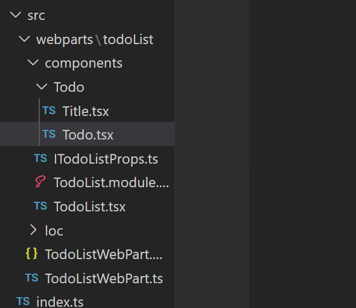
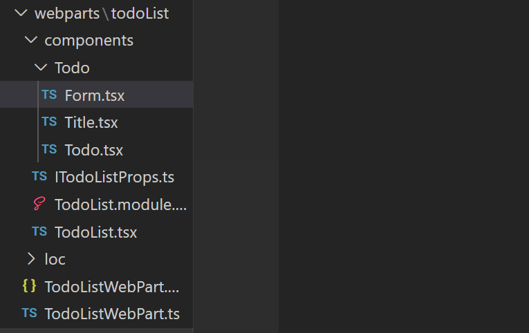

# Lab 2a State Management

In this lab will talk about state management which we saw a little of in the last lab.

## Exercise 1 - Stateful Component 
So far we were mostly dealing with stateles components.  Let's talk about stateful components.  The main difference between a stateless component and stateful component is that one uses state and the other doesn’t. Let’s go ahead and build a stateful component. We will start by creating a component **Todo.tsx** under the todopage folder, so now the structure will look something like this: 



Let’s open the **Todo.tsx** and replace it with the following code:
```tsx
import * as React from 'react';

export interface ITodo {
    id: number,
    task: string,
    isCompleted: boolean
}
export interface ITodoState{
    todos: ITodo[]
}
class Todo extends React.Component<{}, ITodoState> {
  constructor(props) {
    super(props);
    this.state = {
     todos: [
       {
         id: 0,
         task: 'Call JJ from NASA',
         isCompleted: false
       }
     ]
    };
  }

  render() {
    return (
      <ul className="todos-list">
        {
          this.state.todos.map((item: ITodo) => {
            return (
              <li className="todo-item"
                key={item.id}
                onClick={() => console.log('Clicked here')}>
                <span className={item.isCompleted ? "todo-item__name disabled" : "todo-item__name"}>
                  {item.task}
                </span> 
              </li>
            )
          })
        }
      </ul>
    );
  }
}

export default Todo;
```

Inside the constructor function we have our state and which binds to the context using **this** keyword. The state is always a dictionary with key/value pairs. And in our case, we are initializing our state with an object called todos, which represents an array of objects. Now the way we use the state inside our render method is by referencing it as **this.state.todos**.  We get back the array and we can iterate through the array using the Javascript map functionality.

Last thing to do to be able to view our component is to import Todo into our App.js as shown below:
```jsx
import * as React from 'react';
import styles from './TodoList.module.scss';
import { ITodoListProps } from './ITodoListProps';
import { escape } from '@microsoft/sp-lodash-subset';
import Title from './Todo/Title';
import Todo from './Todo/Todo';

export default class TodoList extends React.Component<ITodoListProps> {
  constructor(props:ITodoListProps) {
    super(props);
    console.log('inside the constructor');
    this.state = { visible: false, time: new Date() }; // Add
  }
  
  componentDidMount() {
    console.log('Component just mounted');
  }
  
  public render(): React.ReactElement<ITodoListProps> {
    console.log('Rendering my component');        //>>> Add
    return (
      <div className={ styles.todoList }>
        <Title/>
        <Todo/>
```

If the web page isn't already running, you can start displaying it by entering `gulp serve` in the terminal.  Once the browser loads, we should see something like this:


Let’s add to our Todo folder another component and this time it will be called **Form.tsx** (so we are creating a file called Form.tsx under Todo folder).  The structure of our project should look like this now: 



Let’s open the newly created file, **Form.tsx**, and copy/paste the following code:
```tsx
import * as React from "react";
import Todo from "./Todo";

export interface IFormState {
  todoValue: string;
}

class Form extends React.Component<{}, IFormState> {
  constructor(prop: {}) {
    super(prop);
    this.state = {
      todoValue: "",
    };
  }
  render() {
    return (
      <form className="form">
        <input
          type="text"
          className="form__input"
          placeholder="Add todo"
          onChange={(e: React.ChangeEvent<HTMLInputElement>) => this.setState({todoValue: e.target.value})}
          value={this.state.todoValue}/>
        <button
          className="form__button"
          type="submit"
          onClick={(e) => {
              e.preventDefault();
              console.log("trying to submit - " + this.state.todoValue)}}
        >
          ╋
        </button>
      </form>
    );
  }
}

export default Form;

```

And let’s add the Form component into the Todo component:
```tsx
import * as React from "react";
import Form from "./Form";

export interface ITodo {
  id: number;
  task: string;
  isCompleted: boolean;
}
export interface ITodoState {
  todos: ITodo[];
}
class Todo extends React.Component<{}, ITodoState> {
  constructor(props) {
    super(props);
    this.state = {
      todos: [
        {
          id: 0,
          task: "Call JJ from NASA",
          isCompleted: false,
        },
      ],
    };
  }

  render() {
    return (
      <div>
        <Form />
        <ul className="todos-list">
          {this.state.todos.map((item: ITodo) => {
            return (
              <li
                className="todo-item"
                key={item.id}
                onClick={() => console.log("Clicked here")}
              >
                <span
                  className={
                    item.isCompleted
                      ? "todo-item__name disabled"
                      : "todo-item__name"
                  }
                >
                  {item.task}
                </span>
              </li>
            );
          })}
        </ul>
      </div>
    );
  }
}

export default Todo;

```

For now, we can test the webpart and see, that we can enter the value in the textbox and the Submit button (+) will produce only the log in the developer console.

So now let's make it possible to save the values in the State of the Todo component. For that we need to create a callback function, which needs to be passed into the Form component:

***Form.tsx***
```tsx
import * as React from "react";
import Todo from "./Todo";

//Add Props interface
export interface IFormProps{
    onSubmit: (value: string) => void
}

export interface IFormState {
  todoValue: string;
}

class Form extends React.Component<IFormProps, IFormState> {
  constructor(prop: IFormProps) {
    super(prop);
    this.state = {
      todoValue: "",
    };
  }
  render() {
    return (
      <form className="form">
        <input
          type="text"
          className="form__input"
          placeholder="Add todo"
          onChange={(e: React.ChangeEvent<HTMLInputElement>) => this.setState({todoValue: e.target.value})}
          value={this.state.todoValue}/>
        <button
          className="form__button"
          type="submit"
          onClick={(e) => {
              e.preventDefault();
              console.log("trying to submit - " + this.state.todoValue);
              //>>> Submit and clear the input field after submitting
              this.props.onSubmit(this.state.todoValue);
              this.setState({todoValue: ""});
            }}
        >
          ╋
        </button>
      </form>
    );
  }
}

export default Form;

```
***Todo.tsx***
```tsx
import * as React from "react";
import Form from "./Form";

export interface ITodo {
  id: number;
  task: string;
  isCompleted: boolean;
}
export interface ITodoState {
  todos: ITodo[];
}
class Todo extends React.Component<{}, ITodoState> {
  constructor(props) {
    super(props);
    this.state = {
      todos: [
        {
          id: 0,
          task: "Call JJ from NASA",
          isCompleted: false,
        },
      ],
    };
  }

  render() {
    return (
      <div>
        <Form onSubmit={this._onSubmit} />
        <ul className="todos-list">
          {this.state.todos.map((item: ITodo) => {
            return (
              <li
                className="todo-item"
                key={item.id}
                onClick={() => console.log("Clicked here")}
              >
                <span
                  className={
                    item.isCompleted
                      ? "todo-item__name disabled"
                      : "todo-item__name"
                  }
                >
                  {item.task}
                </span>
              </li>
            );
          })}
        </ul>
      </div>
    );
  }
  private _onSubmit = (value: string) =>{
      const newId: number = Math.max.apply(Math, this.state.todos.map(todo => todo.id))+1;
      const todo: ITodo = {
          id: newId,
          task: value,
          isCompleted: false
      }
      this.setState({todos: [...this.state.todos, todo ]})
  }
}

export default Todo;

```

You can test the webpart by adding text into the input field and clicking the button or hitting Enter.


