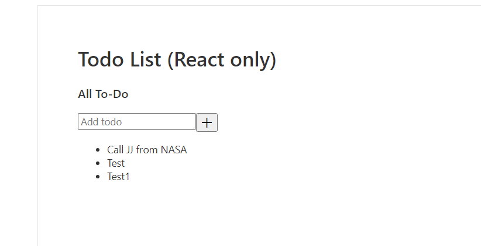

# Lab 2b - Hooks

This lab contains 2 exercises
- Exercise 1 - Create a Functional Component
- Exercise 2 - Using Hooks

## Exercise 1 - Create a Functional Component

In order to use React Hooks we need to transform our Todo.tsx component from a class component to a functional component.

### Steps

### 1. Comment out Todo.tsx 

Let's go ahead and open Todo.tsx file and **comment out everything except the import statement**.  We commented out the Todo class implementation so that we can implement it as a function.

```tsx
import * as React from 'react';
// ...
```

If `gulp serve` is running, the project cannot be compiled.

The error is saying that we are trying to import a component called Todo that doesn't have an export statement. To fix the error let's create a functional version of the Todo component.  Ue the tsx below as a simplified version of our earlier Todo component.  Don't worry about state and other methods that we had in our class component.  Just implement it to render the tsx.  When you're done, scroll down to check your work.

<br/><br/><br/><br/><br/><br/><br/><br/><br/><br/><br/><br/><br/><br/><br/><br/><br/><br/><br/><br/><hr/>

**Solution**:
Your functional Todo component should look like this.  If you implement it as a regular function, that's ok.
```tsx
// ... (Todo class commented out)
export interface ITodo {
  id: number;
  task: string;
  isCompleted: boolean;
}

const Todo = () => {
  const todos: ITodo[] = [
    {
      id: 0,
      task: "Call JJ from NASA",
      isCompleted: false,
    }
  ]

  return (
    <div>
      {/* <Form onSubmit={this._onSubmit} /> */}
      <ul className="todos-list">
        {todos.map((item: ITodo) => {
          return (
            <li
              className="todo-item"
              key={item.id}
              onClick={() => console.log("Clicked here")}
            >
              <span
                className={
                  item.isCompleted
                    ? "todo-item__name disabled"
                    : "todo-item__name"
                }
              >
                {item.task}
              </span>
            </li>
          );
        })}
      </ul>
    </div>
    );
}

export default Todo;
```

If we go to check our web app, we'll find that our app is now running without any error. 

But our application isn't able to track state, so let's fix that as well. 


## Exercise 2 - Using Hooks

Let's start by adding useState into our Todo.tsx component. "useState" is a hook that will enable a functional component to track state.  Use useState to track Todos values for the functional component. When you're done, check your work against the solution below.
<br/><br/><br/><br/><br/><br/><br/><br/><br/><br/><br/><br/><br/><br/><br/><br/><br/><br/><br/><br/><hr/>

**Solution**:

```tsx
const Todo = () => {
  const [todos, setTodos] = React.useState([{
    id: 0,
    task: "Call JJ from NASA",
    isCompleted: false,
  }]);

  return (
    <div>
      {/* <Form onSubmit={this._onSubmit} /> */}
      <ul className="todos-list">
        {todos.map((item: ITodo) => {
          return (
            <li
              className="todo-item"
              key={item.id}
              onClick={() => console.log("Clicked here")}
            >
              <span
                className={
                  item.isCompleted
                    ? "todo-item__name disabled"
                    : "todo-item__name"
                }
              >
                {item.task}
              </span>
            </li>
          );
        })}
      </ul>
    </div>
    );
}
```

We are now tracking changes of the todos, but for now there is no way for us to update the todos. So similar to how we had in the class componennt, let's add a nested onSubmit  function to add Todo items and also send the Submit handler to the nested Form component.  Make those changes and scroll down to compare your work against the solution.

<br/><br/><br/><br/><br/><br/><br/><br/><br/><br/><br/><br/><br/><br/><br/><br/><br/><br/><br/><br/><hr/>

**Solution**:
```jsx
const Todo = () => {
  const [todos, setTodos] = React.useState([
    {
      id: 0,
      task: "Call JJ from NASA",
      isCompleted: false,
    },
  ]);

  const _onSubmit = (value: string) => {
    const newId: number =
      Math.max.apply(
        Math,
        todos.map((todo) => todo.id)
      ) + 1;
    const todo: ITodo = {
      id: newId,
      task: value,
      isCompleted: false,
    };
    setTodos([...todos, todo]);
  };

  return (
    <div>
      <Form onSubmit={_onSubmit} />
      <ul className="todos-list">
        {todos.map((item: ITodo) => {
          return (
            <li
              className="todo-item"
              key={item.id}
              onClick={() => console.log("Clicked here")}
            >
              <span
                className={
                  item.isCompleted
                    ? "todo-item__name disabled"
                    : "todo-item__name"
                }
              >
                {item.task}
              </span>
            </li>
          );
        })}
      </ul>
    </div>
  );
};

export default Todo;
```

Verify that everything works as before by trying to add items in the todos list



