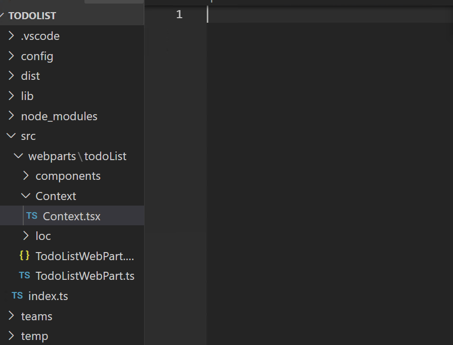
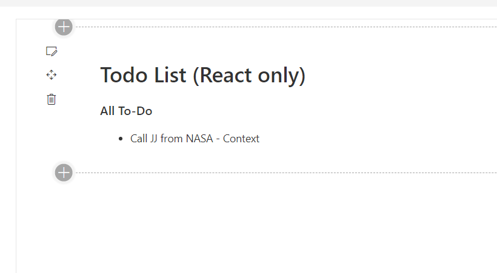

# Lab 2c - Context API

## Exercise 1 - Create context component

Let's imagine, that the list of todos will be used by many other components. This is not convenient to pass the list of todos and the method to update the todos as properties into other components, especially when those components do not use that. So let's create the context component with all the state properties and methods to update the state.

Create a new folder **Context** with the **Context.ts** component inside. After you finished, your project structure should looke like this:



Inside the **Context.ts** let's define the inteface for the state, create it and export it.

```ts
import * as React from 'react'
import { ITodo } from '../components/Todo/Todo';

export interface IContext{
    todos: ITodo[],
    setTodos: (value: string)=> void
}

export const ThemeContext = React.createContext<IContext>({
    todos: [],
    setTodos: (value: string) => {}
});
```
We have defined 2 properties in the Context:
- todos - we will store the todo items in the array
- setTodos - we will use the method to update the Todos

But we only defined, which methods the context should have. However, we have not created the component itself, where everything will be stored. So let's do this. We need to do the following:
- create the component with the name ContextProvider;
- create the state, that must store todos items
- create a private method, that will handle update of todos
- bind the state and the context to the Context.Provider component and return it.


<br/><br/><br/><br/><br/><br/><br/><br/><br/><br/><br/><br/><br/><br/><br/><br/><br/><br/><br/><br/><hr/>

**Solution**:
```tsx
import * as React from 'react'
import { ITodo } from '../components/Todo/Todo';

export interface IContext{
    todos: ITodo[],
    setTodos: (value: string)=> void
}
export const Context = React.createContext<IContext>({
    todos: [],
    setTodos: (value: string) => {}
});

class ContextProvider extends React.Component<{}, {todos: ITodo[]}> {
    constructor(props){
        super(props);
        this.state = {
            todos: [{
                id: 0,
                task: "Call JJ from NASA - Context",
                isCompleted: false,
                }]
        }
    }
    private setTodos = (value: string) =>{
        const newId: number =
      Math.max.apply(
        Math,
        this.state.todos.map((todo) => todo.id)
      ) + 1;
    const todo: ITodo = {
      id: newId,
      task: value,
      isCompleted: false,
    };
        this.setState({todos:[...this.state.todos, todo]});
    }

    render() {
      return (
        <Context.Provider value={{todos: this.state.todos, setTodos: this.setTodos}}>
          {this.props.children}
        </Context.Provider>
      );
    }
  }
export default ContextProvider;

```
Please, notice, how we added `{this.props.children}` inside the provider. This will help us to render any children components inside the ContextProvider.

If we go to check our web app, we'll find that our webpart is running without errors. However, the Context has not yet been used inside the webpart. Let's do that.

## Exercise 2 - Adding ContextProvider to our webpart.

You need to open the **TodoList.tsx** and wrap your title and Todo components inside the ContextProvider. After we do this, all the components, that are located inside the ContextProvider or even below (children of children) will have access to the context.
<br/><br/><br/><br/><br/><br/><br/><br/><br/><br/><br/><br/><br/><br/><br/><br/><br/><br/><br/><br/><hr/>

**Solution**:

```tsx
public render(): React.ReactElement<ITodoListProps> {
    console.log('Rendering my component');
    return (
      <div className={ styles.todoList }>
        <ContextProvider>
          <Title/>
          <Todo />
        </ContextProvider>
      </div>
    );
  }
```

## Exercise 3 - Consuming the state.

We have 2 components, where we need to use the context properties:
- *Todo.tsx* - we need to display the list of todos
- *Form.tsx* - upon button click we need to update the list of todos

Let's first display the list of todos from our Context inside the **Todo.tsx**. For that we will use anothe hook, which is called *useContext*. It will return use the Context object:

```tsx
const context: IContext = React.useContext(Context);

```
Let;s meanwhile comment the **Form** component and remove all the methods we do not need any more, like *_onSubmit*. **Todo.tsx** should look like this:

```tsx
const Todo = () => {
  const context: IContext = React.useContext(Context);
   return (
    <div>
      {/* <Form onSubmit={_onSubmit} /> */}
      <ul className="todos-list">
        {context.todos.map((item: ITodo) => {
          return (
            <li
              className="todo-item"
              key={item.id}
              onClick={() => console.log("Clicked here")}
            >
              <span
                className={
                  item.isCompleted
                    ? "todo-item__name disabled"
                    : "todo-item__name"
                }
              >
                {item.task}
              </span>
            </li>
          );
        })}
      </ul>
    </div>
  );
};

export default Todo;
```

The webpart should now display 1 todo item, however it comes from the context, because we see the Context at the end:



The last past that we still have to do is to add the function, that updates todos, inside the **Form.tsx** component. But the Form component is a class one. We cannot use states. For that we can use the static property of the Component, defining the type of the property:

```ts
  static contextType = Context;
  context!: React.ContextType<typeof Context>;
```

After we added context to the component, we can remove our old methods, component props and use the ones from the contex:

**Solution**:
```tsx
import * as React from "react";
import { Context, IContext } from "../../Context/Context";

export interface IFormState {
  todoValue: string;
}

class Form extends React.Component<{}, IFormState> {
  static contextType = Context;
  context!: React.ContextType<typeof Context>;

  constructor(prop) {
    super(prop);
    this.state = {
      todoValue: "",
    };
  }
  render() {
    return (
      <form className="form">
        <input
          type="text"
          className="form__input"
          placeholder="Add todo"
          onChange={(e: React.ChangeEvent<HTMLInputElement>) => this.setState({todoValue: e.target.value})}
          value={this.state.todoValue}/>
        <button
          className="form__button"
          type="submit"
          onClick={(e) => {
              e.preventDefault();
              console.log("trying to submit - " + this.state.todoValue);
              //>>> Use the context method here
              this.context.setTodos(this.state.todoValue);
              this.setState({todoValue: ""});
            }}
        >
          ╋
        </button>
      </form>
    );
  }
}

export default Form;
```

And also you should uncomment the Form component inside the **Todo.tsx** and remove the `onSubmit` property:

```tsx
const Todo = () => {
  const context: IContext = React.useContext(Context);
   return (
    <div>
      <Form /> 
      <ul className="todos-list">
```
Now the component will add todos into the ContextProvider.

